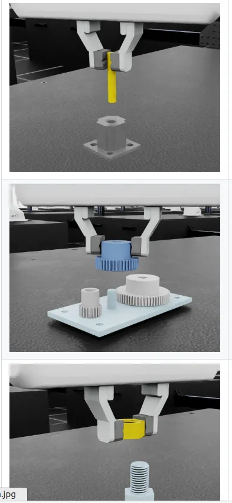
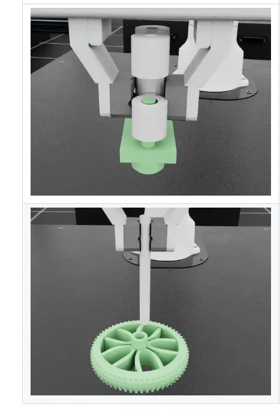
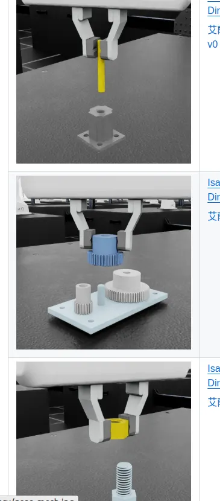

# 操作任务

**reach 到达 / 定位**
末端执行器移动到采样目标姿态
衡量指标为物体到目标点的具体`position_error`，Nvidia的默认demo最终收敛到0.0284m
任务复杂度：简单，输入是state按照默认配置训练是10分钟

**lift 举升 / 抓取**
机械臂将方块举起到一个随机生成的目标点位
衡量指标为物体到目标点的具体`position_error`，Nvidia的默认demo最终收敛到0.1m
任务复杂度：中等，输入是state按照默认配置训练是10分钟

**cabinet 柜体操作**
抓住橱柜抽屉的把手，拉开抽屉
官方没有衡量指标
任务复杂度：困难，输入是state按照默认配置训练30分钟

**stack 堆叠**
堆叠三个立方体（从下到上：蓝色、红色、绿色）
Stack 使用的是 Robomimic 框架的行为克隆（BC），不是 RL

**dexsuite KUKA机械臂 + Allegro Hand灵巧手（不合适）** 
拾取桌面上的物体并提升到目标位置 + 拾取物体并按目标姿态重新定向
**inhand 手内操作（灵巧手精细操作，不合适）**
指尖立方体旋转到对于姿态

**pick_place  拾取 - 放置（人型机器人相关）**
用 GR-1 类人机器人把一个物品捡起来放进篮子里
**place 放置（人型机器人相关）**
Agibot机器人-右臂-玩具入盒放置任务 + Agibot机器人-左臂-杯子放置任务

**source/isaaclab_tasks/isaaclab_tasks/direct/factory/ 工厂装配**
"Isaac-Factory-PegInsert-Direct-v0"：用 Franka 机器人将插销插入套筒
"Isaac-Factory-GearMesh-Direct-v0"：用 Franka 机器人将齿轮插入并与其他齿轮啮合到底座中
"Isaac-Factory-NutThread-Direct-v0"：用 Franka 机器人把螺母拧到螺栓的前两颗螺纹上

**source/isaaclab_tasks/isaaclab_tasks/direct/automate/init.py 自动化装配**
"Isaac-AutoMate-Disassembly-Direct-v0" 用Franka机器人将插头从插座中拔出
"Isaac-AutoMate-Assembly-Direct-v0"用Franka机器人将插头插入对应的插座

**source/isaaclab_tasks/isaaclab_tasks/direct/forge/init.py 锻造（和上面工厂装配类似，可能是迭代版本）**
Isaac-Forge-PegInsert-Direct-v0 用 Franka 机器人将插销插入套筒
Isaac-Forge-GearMesh-Direct-v0 用 Franka 机器人将齿轮插入并与其他齿轮啮合到底座中
Isaac-Forge-NutThread-Direct-v0 用 Franka 机器人把螺母拧到螺栓的前两颗螺纹上

